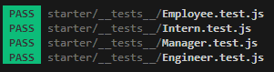

# Automatic command-line team generator

## Table of Contents

- [Project Description](#Description)
- [Installation](#Installation)
- [Usage](#Usage)
- [License](#License)
- [Contributing](#Contributing)
- [Testing](#Testing)
- [Questions](#Questions)

## Description
Using this simple little tool, you will be able to create an HTML webpage that displays a team of employees and their manager. Rather than using spreadsheets, simply enter the tam members and an easy to understand HTML page will be generated with each employee, their title and other details about them. The outputted html file will look like this:

## Installation
To install this app, simply download the files to your system and put them where you need them. This can be on your local machine or a server. 

1. Open your terminal and navigate to the project Root folder
2. Type npm i to install all required packages
3. Once install is complete, make sure the package.json file contains the following code:
    {
    "devDependencies": {
        "inquirer": "^6.3.1",
        "jest": "^29.5.0"
    },
    "scripts": {
        "test": "jest"
    }
    }

## Using the test (Jest) system

Check that all tests pass by:
1. Open your terminal to the project root folder
2. Type npm test to check all tests pass. If they do it should look like this:

## Using the Team Page Generator

To generate a team:
1. Open your terminal and navigate to the 'starter' folder - note this is very important!
2. Simply type 'node index.js' to launch the generator.

You will be presented with a series of questions, follow them one-by-one until you are presented with the success message and a new team.html file is automatically added to the assets folder. You may wish to make sure the assets folder does not already contain a previously generated team.html file. It doesn't matter if it does because the generator will only ever overwrite the contents of the pre-existing file anyway.

The repository can be found here:

https://github.com/R0bsaunders/auto-team-profile-generator

## Contributors
To contribute to the app, please send me an email.

## Testing
The app has been tested on a Laptop running Windows 11 using both powershell and gitBash terminals. No errors have been returned but if you come across any, please do let me know.

## Questions
You can get in touch by using the following:

### GitHub
**[R0bSaunders](https://github.com/R0bSaunders)**

### Email
**[me@rob-saunders.co.uk](me@rob-saunders.co.uk)**

## License
This code is distributed under the MIT License.
